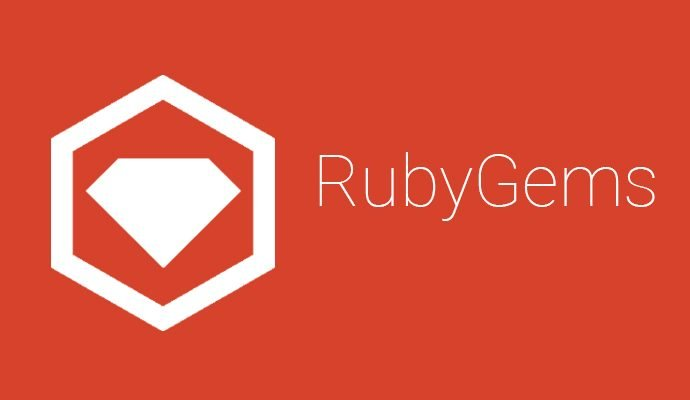

# RubyGems
My works related to RubyGems, a package manager for the Ruby programming language.

## Table of Contents
1. [Introduction.](#introduction)
2. [Official references websites.](#references)
3. [Ruby developers.](#developers)
4. [GitHub notes.](#github)
5. [GitHub repository calculation.](#calculation)

<a name="introduction"></a>
## 1. Introduction.
 
RubyGems is a package manager for the Ruby programming language that provides a standard format for distributing Ruby programs and libraries (in a self-contained format called a "gem"), a tool designed to easily manage the installation of gems, and a server for distributing them. It was created by Chad Fowler, Jim Weirich, David Alan Black, Paul Brannan and Richard Kilmer during RubyConf 2004.
<br /><br />
The interface for RubyGems is a command-line tool called gem which can install and manage libraries (the gems). RubyGems integrates with Ruby run-time loader to help find and load installed gems from standardized library folders. Though it is possible to use a private RubyGems repository, the public repository is most commonly used for gem management.
<br /><br />
The public repository helps users find gems, resolve dependencies and install them. RubyGems is bundled with the standard Ruby package as of Ruby 1.9. Development on RubyGems started in November 2003 and was released to the public on March 14, 2004, or Pi Day 2004. In 2010, the default public repository for gems moved from http://gems.rubyforge.org to http://rubygems.org, which is still in use. Also, RubyGems development was moved to GitHub in 2010. Though RubyGems has existed since Ruby 1.8, it was not a part of the standard Ruby distribution until Ruby 1.9.

<a name="references"></a>
## 2. Official references websites. 
RubyGems official website : https://rubygems.org <br />
RubyGems official documentation : https://guides.rubygems.org <br />

**_RubyGems packages_** <br />
bundler : https://rubygems.org/gems/bundler <br />
rails : https://rubygems.org/gems/rails <br />
gem : https://rubygems.org/gems/gem <br />

<a name="developers"></a>
## 4. RubyGems developers.
Chad Fowler : https://github.com/chad, https://twitter.com/chadfowler <br />
Jim Weirich : https://github.com/jimweirich, https://twitter.com/jimweirich <br />
Paul Brannan : https://github.com/cout <br />
Richard Kilmer : https://github.com/richkilmer <br />
 
<a name="github"></a>
## 5. GitHub notes.
Clone the current GitHub remote repository contents into local machine.
```
$ git clone https://github.com/syakirharis25/RubyGems.git
$ cd RubyGems/
$ git remote -v
$ git status
```

<a name="calculation"></a>
## 6. GitHub repository calculation.
```
draft
```
Refer to : https://github.com/syakirharis25/cloc
